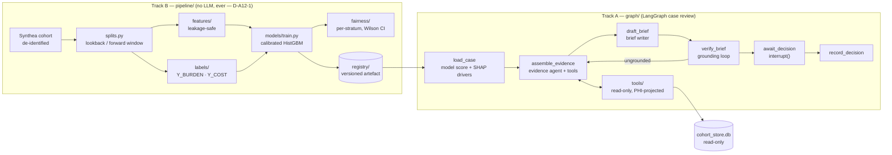

# Architecture overview

A12 carries both halves of the portfolio's app template at once, and that
duality is the app's thesis, not a layout compromise: **the model
decides, the agent explains.**



## Why two halves, not one

Every number a clinician could act on without a human in the loop —
the risk score, the risk tier, the fairness audit — comes out of `pipeline/`,
which contains no LangChain or LangGraph import at all (enforced by an
import-linter contract, not just a convention). The LLM never sees the
raw model output before a person does; it only ever explains a score
`graph/nodes/load_case.py` already computed. This is
[D-A12-1](decisions/D-A12-1-llm-is-not-the-risk-model.md), and it's why
the repo is laid out this way rather than as one monolithic `agent/`
package with a model call buried inside a tool.

## Layering (enforced by import-linter, 5 contracts)

```
api  →  graph  →  {tools, guardrails}  →  pipeline  →  schemas / settings
```

- **`api/`** — FastAPI routes, SSE streaming, the queue/decision stores.
  Never imported by anything below it.
- **`graph/`** — the case-review `StateGraph`: `nodes/` (deterministic and
  LLM-backed steps), `chains/` (LLM calls with structured output),
  `agents/` (the tool-calling evidence agent). `chains/` may never import
  `nodes/` — a chain is a stateless function of its input, not a step
  that reaches into graph state.
- **`tools/`** — five read-only `StructuredTool`s the evidence agent can
  call, each behind `guardrails/phi_projection.py`'s field allowlist.
  `tools/` may never import `graph/`: a tool is a leaf, not a participant
  in control flow.
- **`pipeline/`** — the model half: `splits/`, `features/`, `labels/`,
  `models/`, `calibration/`, `thresholds/`, `fairness/`, `explain/`,
  `cards/`, `registry.py`. No LangChain or LangGraph import may appear
  anywhere in this package.
- **`schemas/` and `settings.py`** — typed contracts (`CaseBrief`,
  `Driver`, ...) and configuration. Depended on by everything, depend on
  nothing above them.

## The case-review graph, one node at a time

1. **`load_case`** — deterministic, not an agent step ("don't spend an
   LLM call on a decision an `if` can make"). Scores the patient against
   the deployed calibrated model, sets `risk_score` and `risk_tier`, and
   attaches SHAP feature attribution as `drivers` — all before any LLM
   node runs.
2. **`assemble_evidence` ⇄ `tools`** — a tool-calling evidence agent
   gathers corroborating encounters, labs, care gaps, and missing-data
   flags. Every tool is read-only and PHI-projected.
3. **`draft_brief`** — a structured-output chain writes `CaseBrief`.
   `narrative` is its only free-text field; there is no field anywhere in
   the schema for a risk tier or a decision.
4. **`verify_brief`** — the grounding loop: each claim in the brief is
   checked against the recorded tool results. An ungrounded brief routes
   back to `assemble_evidence` for another pass (capped by
   `MAX_REVISIONS`), never silently rewritten.
5. **`await_decision`** — a real LangGraph `interrupt()`. The graph
   pauses here; nothing past this point runs without a human decision.
6. **`record_decision`** — persists the clinician's enrol/decline/defer
   call and any override notes.

## Persistence

Three separate SQLite stores, each with one job:

- **`cohort.db`** (`CohortStore`) — read-only, built once by
  `data/build_cohort_store.py`. The pipeline never reads it; it exists
  only for the tool layer.
- **`queue.db`** (`QueueStore`) — read-write. The clinician review queue,
  decisions, and the SSE event log the frontend streams from.
- **`checkpoints.db`** — the LangGraph checkpointer (`AsyncSqliteSaver`),
  so an `interrupt()`ed case-review run survives a server restart.

## Validation

Two more layers gate correctness beyond unit tests:
`tests/graph/test_case_review_integration.py` proves the graph's control
flow — including a real `interrupt()`/resume cycle — with fake LLM
stand-ins; `make validate` (see
[evidence/validation-harness.md](../evidence/validation-harness.md)) gates
PR CI on ML metric floors over a frozen data split and four canonical
brief scenarios run against the real, non-LLM parts of the graph.
