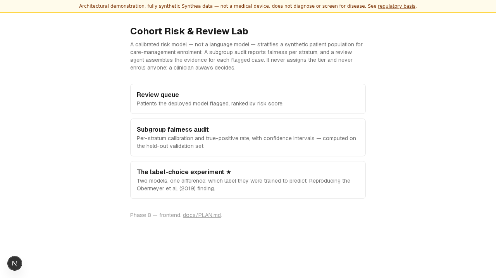

# Cohort Risk & Review Lab

> The model decides. The agent explains. The human approves. And the fairness
> number is reported per subgroup, not in aggregate.

Portfolio app **A12** (`PORTFOLIO_PLAN_V3.md` §7). Healthcare — population
health / care management, Pillar 2 — Governance & Security. Target URL:
`cohort.zarreh.ai` (not yet deployed — see Status below).

Over a synthetic [Synthea](https://synthetichealth.github.io/synthea/)
population, a calibrated risk model stratifies patients for enrolment in a
care-management programme. A subgroup audit reports calibration and
true-positive-rate parity across age, sex, race and insurance strata — not a
single aggregate AUC. Every flagged patient lands in a clinician review
queue, where an agent assembles the case: which features drove the score,
which encounters and labs corroborate it, what data is missing, and what
would change the answer. **The agent never assigns the risk tier, and it
never enrols anyone** — see
[architecture/decisions](architecture/decisions/index.md) D-A12-1 for how
that is enforced structurally rather than asserted in a prompt.

## Status

**Phase 9 — a validation harness gating PR CI**: `make validate` fits both
models against a small, real, committed frozen split (a seeded sample of
the actual generated cohort, not invented data) and checks that AUROC,
calibration, and the label-choice enrolment gap all clear regression
floors, then runs four canonical patient vignettes through the real
risk-scoring node and tools. See
[evidence/validation-harness.md](evidence/validation-harness.md).

**Phase 8 — a working full-stack app**, verified against a live backend and
frontend together, not just unit tests: a real 30,000-patient Synthea
cohort, two calibrated models reproducing the Obermeyer et al. (2019)
label-choice finding, a per-stratum fairness audit, a LangGraph evidence
agent with `interrupt()`-based human review, a FastAPI backend with SSE
streaming and SQLite persistence, and this Next.js frontend — every page
rendering real numbers from the real backend (queue of 19,409 flagged
patients, the fairness audit table, the label-choice chart). No OpenAI API
key is available in this build environment, so the LLM-backed evidence
agent itself is verified structurally rather than against a live model
response — see [D-A12-1](architecture/decisions/D-A12-1-llm-is-not-the-risk-model.md).

> **In one paragraph, for a non-engineer:** this app takes a synthetic
> hospital's worth of patients, uses a statistical model — not a language
> model — to flag who might benefit from a care-management programme, then
> checks whether that model is fair across race, sex and age before anyone
> acts on it. A separate AI assistant then gathers the evidence a clinician
> would want to see, but it never makes the call itself — a person always
> does.

This is a research prototype built entirely on synthetic Synthea data. It is
**not** a medical device, does not diagnose, and does not screen for disease
— see [regulatory-basis.md](regulatory-basis.md).
